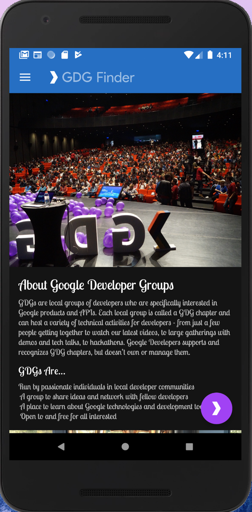

# Desinging for Everyone - GDG Finder app

These toy apps are my Kotlin Exercises by taking the Udacity courses from [Android App Development in Kotlin course on Udacity](https://classroom.udacity.com/courses/ud9012/).
 
## Video Walkthrough

### Lesson 01 Dice Roller - Basic
1. The basics of Android App.

***

### Lesson 02a AboutMe - Layout
1. User inputs

  
***

### Lesson 02b ColorMyViews - ConstraintLayout
1. User ConstraintLayout

***

### Lesson03 AndroidTrivia - Navigation
1. Creating and Adding a Fragment
2. Create Navigation graph and set navigation to navigate through fragments. 
3. Conditional Navigation: navigate 1 fragment to 2 different fragments with different conditions.
4. Back Stack Manipulation: 1. Navigate back and skip a fragmen。 2. Add actions: pop back and skip a fragment.
5. Adding Support for the Up Button: 向上按钮（使用navigation）
6. Adding the About Menu: 在menu上加上about fragment。通过navigation连上，menu上item的id = navigation.xml's fragment id
7. Adding Safe Arguments: 使用safe args，用bundle在不同fragment中pass message。并且用safe args获取R.id...
8. Sharing Success: 增加“分享”信息功能，如果可以处理“分享inent”就显示“分享”按钮，否则就不显示
9. Adding the Navigation Drawer
10. Using Navigation Listeners: 只在第一页可以使用 drawer. 在别的页都禁用drawer. Add animation to actions: 给不同屏幕切换，添加动画

***

### Lesson04 DessertPusher - Lifecycle
1. Logging a callback
2. Timber for logging: 使用Timber 简化Log, 使用application class设置可以让整个程序使用的utility
3. Setup and tear down: 使用handler实现一个记秒数的class，只要app可见就不断的在logcat上显示秒数，不可见就关闭
4. Add the lifecycle library: 使用lifecycle library， 让DessertTimer自动检测lifecycle状态，自动开始和停止，不需要在MainActivity中的onStart,onStop设置。
5. Implement onSaveInstanceState: 使用onSaveInstanceState记录信息，当返回时不丢失需要的信息，用terminal adb命令 模拟app在后台被关闭的情况。

***

### Lesson05 GuessIt - ApplicationArchitecture
1. Create the GameViewModel: 用 ViewModel 来数据与界面分离，同时会自动处理屏幕旋转,暂时离开界面数据不丢失的情况. 用ViewModelProviders创建fragment和viewModel的联
2. Populate the GameViewModel: 按照之前创建的viewModel框架修改代码，移动 variables 和 methods（有bug，之后修改）
3. Add LiveData to GameViewModel: LiveData: observe 变量，当他有变化时可以自动call methods，这样可以让变量改变时自动更新屏幕上的数据
4. Add LiveData Encapsulation: 因为score对于fragment不应该可以修改，所以他的set method对2个class的权限应该不同，所以Make a backing property for the external version that returns the internal MutableLiveData as a LiveData
5. Add End Game Event: 用一个boolean LiveData来触发game有没有结束
6. Add the Timer: CountDownTimer 增加一个倒计时功能，倒计时结束game finish
7. Add a ViewModelFactory: 如果ViewModel的构造函数需要参数（因为ViewModel是自动创建的不是我们自己创建的），就使用 ViewModelFactory 自动初始化。
8. Add ViewModel to Data Binding: 直接把ViewModel中的method 和 xml 中的 button bind。在layout xml中设置 ViewModel variable， 并在button中设置onClick ，并用lambda @{() -> ...} 设置onClickListener，让xml中的button直接和ViewModel binding，这样就不用在fragment中设置listener了。
9. Add LiveData Data Binding: 直接把ViewModel中的 LiveData 和 xml 中的 textView bind。在layout xml中设置 ViewModel variable， 并在 textView 中的 text 属性 @{...} 设置值，这样就不用在fragment中设置 observe 了。
10. Map Transformation: 有些 LiveData 要经过转换才能与 xml bind。比如把时间转换成string
11. Optional Add Buzzing: 让app横屏显示（方便玩游戏），设置手机震动（不同的情况震动不同）

***

### Lesson06 SleepQualityTracker - Database
1. Create Night Data Entity: 用annotation 创建表格的名字，table name， column name，包括指定primary和id自动增加
2. Create SleepDatabaseDao: 使用Dao，把kotlin function和需要操作的database query map到一起。
3. Create and Test RoomDatabase: 创建 和 测试(测试模块)SleepDatabase，包括：连接Dao和Entities，生成一些static属性和method（database，版本号），如果还没有database存在，就生成一个新的，如果有，就用已经存在的.
4. Add ViewModel: 在fragment中配置 ViewModel 和 binding, ViewModel传入database, ViewModelFactory传入database
5. Coroutines重要！！！: 1. 在ViewModel中实现数据库操作，使用 Coroutine, 在别的线程进行数据库操作。2. 在xml里把button和他在ViewModel中对应的function绑定。3. 在屏幕上显示从数据库中得到的数据（是LiveData，需要用Transformations.map转换）
6. Record SleepQuality: 记录sleep quality(更新database)，navigate between fragments：使用 LiveData。并完成 从 SleepQualityFragment -> SleepTrackerFragment
7. Add Button States and SnackBar: 1. 自动控制button的visible情况：用xml中的 enabled 和 Transformations.map   2. 当清空所有数据的时候显示一个 SnackBar message。

***

### Lesson07 SleepQualityTracker - RecyclerView
1. Add a RecyclerView
2. Display Data: 在 fragment 中 bind adapter， 用 ViewModel 中的 LiveData 传入adapter 数据
3. Recycling ViewHolders
4. Display SleepQuality List: 创建 ViewHolder
5. Refactor onBindViewHolder: 把原来在 SleepNightAdapter中onBindViewHolder 里的 logic 移动到 class ViewHolder 里去
6. Refactor onCreateViewHolder: 把 在SleepNightAdapter.onCreateViewHolder中 的 LayoutInflater 之类的 logic，都移到 class ViewHolder 中。这样所有的关于如何绑定数据的内容都到了 class ViewHolder 中了，Adapter只负责call。
7. Add DiffUtil to Adapter: 使用 DiffUtil 优化 recyclerView,DiffUtil可以自动检测item是changed，added，removed... 这样修改数据的时候就不用把所有的数据重新加载，只要修改变动的地方。
8. Add DataBinding to Adapter: add DataBinding and use it in the ViewHolder
9. Add Binding Adapters: BindingAdapter: 实现ViewHolder 中的 view 的 data-binding
10. Replace LinearLayout with GridLayout: 把之前的LinearLayout改成GridLayout
11. Implement a Click Listener: 实现recyclerView每个item的点击，用data-binding直接与xml绑定
12. Navigate on Click: 点击recyclerView，navigate到 detail fragment，用ViewModel 的LiveData实现
13. Add a List Header: 给list加个header，这样就有2种type的ViewHolder, 用 sealed class 封装2种类型的数据，在background thread把原来的type list转换成新的type list。修复了1个bug，以前添加了一个item，因为我们不会刷新整个list，所以添加后会看不看那个新的item。现在因为header永远在第一个，这样即使添加item，因为定位的地方在header，所以会显示那个添加的item。
14. Add Header to GridLayout: 让header自己占用一整行，用SpanSizeLookup来得到每个position的span size。

***

### Lesson08 MarsRealEstate - Web
1. Making Mars Web Service Contact: 从网上得到string request：1. Retrofit Builder with ScalarsConverterFactory. 2. 创建 MarsApiService interface with @GET getProperties returning a String 3. 用 enqueue 在 background 得到request。
2. Parsing JSON With Moshi: 用 Moshi 把从网络上得到的json数据 parse 成我们需要的object
3. Using Retrofit With Coroutines: 用 Coroutine 不用 Callback
4. Displaying an Internet Image: 用 Glide 加载网上的图片：使用 @BindingAdapter 让data-binding知道，在xml中对于有某种属性的view，做某种操作（xml中的ImageView的imageUrl属性输入是String，利用function自动读取这个String，帮你加载图片，并设置正在加载的loading图标和加载失败要显示的图片）
5. Displaying a Grid of Internet Images: 使用 Grid RecyclerView 显示所有网络图片
6. Error Handling with RecyclerView: 处理error，如果没网络，或连接错误就显示错误图片，如果整个页面在加载，就显示加载中
7. Adding the Detail Screen: 添加详细信息 Detail Frament，点击grid上的图片 navigate 到详细信息
8. Adding a Filter: 添加 filter，用菜单选择只显示 rent 或 buy 或 all。

***

### Lesson09 DevByteViewer - backgroundServices
1. Add DatabaseVideo Entity
2. Add VideoDao
3. Refactor VideoDao: 把从数据库get的list改成 LiveData
4. Add VideosDatabase: 生成database
5. Build a Repository: 创建 Repository，从网上得到最新结果 insert 到 database中
6. Use the Repository: 修改 ViewModel, 使用 Repository
7. Create a Worker: 创建一个 coroutine worker，用于在background更新数据
8. Schedule Background Work: 每天在后台更新一次database，添加一些限制条件（免费网络，电量不低，正在充电...）

***

### Lesson10 GDGFinder - Design
1. Add TextView Attributes
2. Apply a Theme: theme 使用新字体
3. Add Styles to Headers: 添加style
4. Add Floating Action Button
5. Add Material Attributes and Overlay: 使用 theme 的 style：android:textAppearance="?attr/textAppearanceHeadline5"， 使用theme颜色给图片染色 android:tint="?colorOnPrimary"
6. Use Dimens Resources
7. Add Material Colors: 从 https://material.io/tools/color/#!/?view.left=0&view.right=0 上挑选颜色下载文件，用下载的colors.xml 替换原来的xml
8. Add RTL Support:  让app的所有内容从右到左显示，适合那些从右到左的语言的人。要把margin之类的left改成start
9. Add Content Descriptions: 语音帮助（盲人使用）
10. Add Content Grouping: 语音提示：把多个view放一起当作group进行语音提示。
11. Add Live Region: 语音帮助，当view改变的时候提示用户
12. Add a ChipGroup: 在屏幕上方显示一排选项，每次只能选中一个，选中变色，并执行filter。
13. Add Dark Mode Support: 夜间模式

